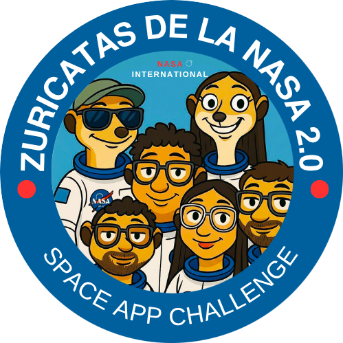

<div align="center">



# 🚀 Zuricatas Simulator
### *Simulador de Impactos de Asteroides con Datos Reales de la NASA*

[](https://www.spaceappschallenge.org/)
[](https://www.spaceappschallenge.org/)
[](LICENSE)
[](https://nodejs.org/)
[](https://reactjs.org/)

**🌍 Simula impactos de asteroides en cualquier lugar del mundo usando datos reales de la NASA**

[🎮 **Probar Demo**](#-demo-en-vivo) • [📖 **Documentación**](#-documentación) • [🚀 **Instalación**](#-instalación-rápida) • [🤝 **Contribuir**](#-contribuir)

---

</div>

## 🌟 ¿Qué es Zuricatas Simulator?

**Zuricatas Simulator** es una aplicación web de última generación desarrollada para el **NASA Space Apps Challenge 2025** bajo el tema **"Meteor Madness"**. Esta plataforma full-stack permite simular escenarios de impacto de asteroides utilizando datos reales de la NASA, ayudando a comprender las consecuencias potenciales y explorar estrategias de mitigación.

### 🎯 Características Principales

<table>
<tr>
<td width="50%">

#### 🔬 **Datos Reales de la NASA**
- 📡 Integración con NASA NeoWs API
- 🌌 Base de datos de 30,000+ asteroides
- 🔄 Sincronización automática diaria
- 📊 Filtrado avanzado por tamaño y peligrosidad

#### 🎮 **Simulación Interactiva**
- 🌍 Selección de ubicación en mapa mundial
- ⚡ Cálculos precisos basados en USGS
- 🎯 Parámetros personalizables
- 📈 Visualización de resultados detallados

</td>
<td width="50%">

#### 🌐 **Visualización 3D**
- 🪨 Modelos 3D de asteroides
- 🌍 Tierra de alta resolución
- 💥 Animaciones de impacto
- 🎮 Controles interactivos

#### 👥 **Plataforma Comunitaria**
- 🔄 Compartir simulaciones
- 👍 Sistema de votación
- 💬 Foros de discusión
- 🏆 Tabla de clasificación

</td>
</tr>
</table>

---

## 🛠️ Stack Tecnológico

<div align="center">

### 🖥️ Frontend


### ⚙️ Backend


### 🔧 Herramientas


</div>

---

## 🚀 Instalación Rápida

### 📋 Prerrequisitos

- **Node.js** 18+ y npm
- **MongoDB** (local o MongoDB Atlas)
- **Clave API de la NASA** (gratuita en [api.nasa.gov](https://api.nasa.gov/))

### ⚡ Instalación en 3 Pasos

```bash
# 1️⃣ Clonar el repositorio
git clone https://github.com/tu-usuario/zuricatas-simulator.git
cd zuricatas-simulator

# 2️⃣ Instalar dependencias
npm run install-all

# 3️⃣ Configurar variables de entorno
cp exampleenv.txt backend/.env
# Editar backend/.env con tus credenciales
```

### 🔧 Configuración del Archivo .env

```env
NODE_ENV=development
PORT=5000
MONGODB_URI=mongodb://localhost:27017/zuricatas
JWT_SECRET=tu_clave_secreta_super_segura
NASA_API_KEY=tu_clave_api_nasa
FRONTEND_URL=http://localhost:3000
```

### 🎮 Ejecutar la Aplicación

```bash
# 🚀 Ejecutar todo (backend + frontend)
npm run dev

# 🔧 Solo backend
npm run backend

# 🎨 Solo frontend  
npm run frontend
```

**🌐 Acceso:**
- **Frontend:** http://localhost:3000
- **Backend API:** http://localhost:5000

---

## 🎮 Demo en Vivo

<div align="center">

### 🌟 Características Destacadas

| 🎯 **Explorador de Asteroides** | 🎮 **Simulador de Impactos** | 🌍 **Visualización 3D** |
|:---:|:---:|:---:|
|  |  |  |
| Explora la base de datos de asteroides de la NASA | Simula impactos en cualquier ubicación | Visualiza impactos en 3D |

</div>

---

## 📊 Métricas de Impacto

<div align="center">

### 🔢 Cálculos Científicos Precisos

```javascript
// 💥 Energía Cinética
Energía = 0.5 × Masa × Velocidad²

// 🕳️ Diámetro del Cráter (USGS)
Diámetro = k × Energía^0.33 × corrección_ángulo

// 🌊 Magnitud Sísmica
Richter = (log₁₀(Energía) - 4.8) / 1.5

// 🌊 Tsunami (Impactos Oceánicos)
Altura_Tsunami = 0.1 × TNT_equivalente^0.25
```

</div>

---

## 🏗️ Arquitectura del Proyecto

```
zuricatas-simulator/
├── 🎨 frontend/                 # React.js Frontend
│   ├── src/
│   │   ├── components/          # Componentes React
│   │   │   ├── 3D/             # Visualizaciones 3D
│   │   │   ├── Navigation.js    # Navegación
│   │   │   └── ProtectedRoute.js
│   │   ├── pages/              # Páginas principales
│   │   │   ├── Dashboard.js    # Panel principal
│   │   │   ├── Simulator.js    # Simulador
│   │   │   └── AsteroidExplorer.js
│   │   ├── context/            # Contextos React
│   │   └── utils/              # Utilidades
│   └── public/
│       └── logo.png            # Logo del proyecto
├── ⚙️ backend/                 # Node.js Backend
│   ├── src/
│   │   ├── models/             # Modelos MongoDB
│   │   ├── routes/             # Rutas API
│   │   ├── middleware/         # Middleware
│   │   ├── utils/              # Utilidades NASA
│   │   └── server.js           # Servidor Express
│   └── package.json
└── 📖 README.md                # Este archivo
```

---

## 🔬 Fundamento Científico

### 📚 Metodología de Cálculo de Impactos

Nuestro motor de simulación emplea algoritmos científicamente validados:

#### 🎯 **1. Cálculo de Energía**
- **Energía Cinética:** `E = 0.5 × m × v²`
- **Masa del Asteroide:** Basada en densidad y volumen
- **Velocidad:** Relativa a la Tierra (11-72 km/s)

#### 🕳️ **2. Formación de Cráteres (Leyes de Escala USGS)**
- **Diámetro:** `D = k × E^0.33 × corrección_ángulo`
- **Constante de Escala:** k = 0.012 (tierra), 0.015 (agua)
- **Corrección por Ángulo:** `sin(ángulo_impacto)^0.5`

#### 💥 **3. Evaluación de Daños por Explosión**
- **Zona Sin Supervivientes:** `0.001 × TNT^0.33 km`
- **Daños Graves:** `0.003 × TNT^0.33 km`
- **Daños Moderados:** `0.01 × TNT^0.33 km`
- **Daños Leves:** `0.03 × TNT^0.33 km`

#### 🌊 **4. Modelado de Tsunamis**
- **Altura del Tsunami:** `0.1 × TNT^0.25 × factor_profundidad`
- **Aplicable solo para impactos oceánicos**

---

## 🌟 Características Avanzadas

### 🎮 **Simulador Interactivo**
- 🌍 **Mapa Mundial Interactivo:** Selecciona cualquier ubicación
- ⚙️ **Parámetros Personalizables:**
  - Ángulo de impacto (15° a 90°)
  - Velocidad (11-72 km/s)
  - Composición (rocoso, metálico, helado)
  - Tipo de superficie (tierra, océano, urbano, rural)

### 📊 **Análisis Multinivel**
- 🕳️ **Formación de Cráteres:** Diámetro, profundidad, volumen
- 💥 **Radios de Daño:** Múltiples niveles de severidad
- 🌊 **Efectos Sísmicos:** Magnitud en escala Richter
- 🌊 **Modelado de Tsunamis:** Para impactos oceánicos
- 🌫️ **Efectos Atmosféricos:** Nubes de polvo, cambios climáticos

### 🎨 **Visualización 3D Avanzada**
- 🪨 **Modelos de Asteroides:** Representaciones 3D detalladas
- 🌍 **Visualización de la Tierra:** Modelo de alta resolución
- 💥 **Animación de Impacto:** Secuencias dinámicas
- 🛰️ **Mecánica Orbital:** Representación precisa de trayectorias

---

## 🚀 Despliegue

### 🌐 **Frontend (Vercel)**
```bash
# 1. Conectar repositorio a Vercel
# 2. Configurar build command: npm run build
# 3. Configurar output directory: build
# 4. Desplegar automáticamente
```

### ⚙️ **Backend (Render/Heroku)**
```bash
# 1. Crear cuenta en Render/Heroku
# 2. Conectar repositorio
# 3. Configurar variables de entorno
# 4. Desplegar servicio backend
```

### 🗄️ **Base de Datos (MongoDB Atlas)**
```bash
# 1. Crear cuenta en MongoDB Atlas
# 2. Crear cluster y base de datos
# 3. Actualizar MONGODB_URI en producción
```

---

## 📈 Roadmap Futuro

### 🎯 **Fase 1: Visualizaciones Mejoradas (Meses 1-3)**
- 🥽 **Integración VR/AR:** Experiencias de impacto inmersivas
- 🎨 **Modelos 3D Avanzados:** Mayor fidelidad en modelos
- ⏰ **Animaciones Time-lapse:** Visualización de efectos a largo plazo
- 📱 **App Móvil:** Aplicaciones nativas iOS y Android

### 🧠 **Fase 2: Modelado Avanzado (Meses 4-6)**
- 🤖 **Machine Learning:** Mejoras en predicción de impactos con IA
- 🌡️ **Modelado Climático:** Simulación detallada de efectos atmosféricos
- 💰 **Modelado Económico:** Evaluación avanzada de impacto económico
- 🏗️ **Simulación de Infraestructura:** Análisis detallado de infraestructura crítica

### 🌍 **Fase 3: Integración Global (Meses 7-9)**
- 🛰️ **APIs Adicionales:** Integración con ESA, JAXA y otras agencias espaciales
- 📡 **Seguimiento en Tiempo Real:** Sistemas de alerta y seguimiento en vivo
- 📚 **Datos Históricos:** Integración de datos de eventos de impacto históricos
- 🛰️ **Imágenes Satelitales:** Integración de datos de observación terrestre en tiempo real

---

## 🤝 Contribuir

### 🚀 **¿Cómo Contribuir?**

1. 🍴 **Fork** el repositorio
2. 🌿 **Crear** una rama de características (`git checkout -b feature/increible-caracteristica`)
3. 💾 **Commit** los cambios (`git commit -m 'Agregar increíble característica'`)
4. 📤 **Push** a la rama (`git push origin feature/increible-caracteristica`)
5. 🔄 **Abrir** un Pull Request

### 🎯 **Áreas de Contribución**
- 🐛 **Reportar Bugs:** Usa el sistema de issues
- 💡 **Nuevas Características:** Propón mejoras
- 📖 **Documentación:** Mejora la documentación
- 🧪 **Testing:** Ayuda con pruebas
- 🌍 **Traducciones:** Soporte multiidioma

---

## 📄 Licencia

Este proyecto está licenciado bajo la **Licencia MIT** - ver el archivo [LICENSE](LICENSE) para más detalles.

---

## 🏆 NASA Space Apps Challenge

Este proyecto fue creado para el **NASA Space Apps Challenge 2025**, específicamente abordando el desafío **"Meteor Madness"**. Demuestra:

- ✅ **Integración de datos reales de la NASA**
- ✅ **Modelado científico de impactos**
- ✅ **Características de colaboración comunitaria**
- ✅ **Valor educativo para concienciación sobre defensa planetaria**

---

## 📞 Soporte y Contacto

<div align="center">

### 🌟 **¿Necesitas Ayuda?**

| 📧 **Email** | 💬 **Discusiones** | 🐛 **Issues** | 📖 **Documentación** |
|:---:|:---:|:---:|:---:|
| [Contacto](mailto:team@zuricatas.com) | [GitHub Discussions](https://github.com/tu-usuario/zuricatas-simulator/discussions) | [Reportar Bug](https://github.com/tu-usuario/zuricatas-simulator/issues) | [Docs](https://docs.zuricatas.com) |

</div>

---

## 🙏 Agradecimientos

<div align="center">

### 🌟 **Gracias Especiales**

- 🚀 **NASA** por proporcionar la API NeoWs y datos de asteroides
- 🏔️ **USGS** por la investigación de escalado de cráteres de impacto
- 🏆 **NASA Space Apps Challenge** organizadores
- 🌍 **Comunidad de código abierto** por las increíbles herramientas y bibliotecas

</div>

---

<div align="center">

## 🌟 **Construido con ❤️ para la defensa planetaria y la educación espacial**

### 🚀 **¡Únete a la misión de proteger nuestro planeta!**

[](https://github.com/tu-usuario/zuricatas-simulator/stargazers)
[](https://github.com/tu-usuario/zuricatas-simulator/network)
[](https://github.com/tu-usuario/zuricatas-simulator/watchers)

**⭐ ¡Dale una estrella si te gusta el proyecto!**

</div>
